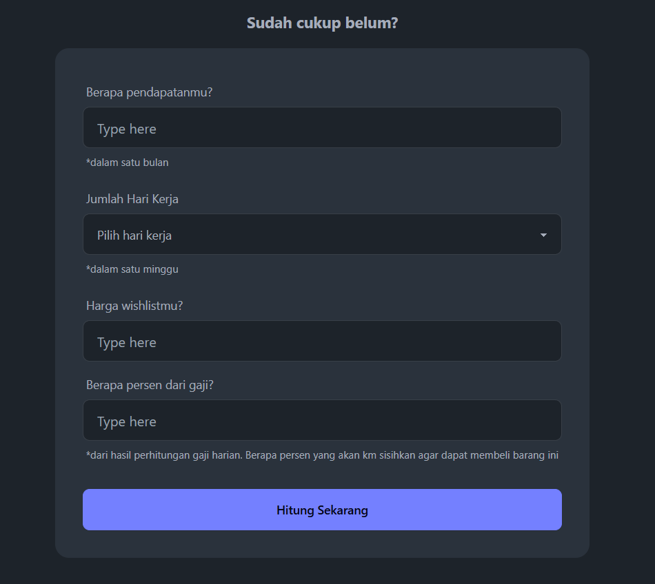

# sudahcukupbelum?

> Untuk menghitung harga barang dalam satuan Day of Work (DOW) berdasarkan gaji harian Anda



## 🚀 Tech Stack

```text
- HTML
- CSS
- Javascript
- Astro JS
- Tailwind
- Daisy UI
```

## 👀 Want to collaboration?

Feel free to fork this repo. Thanks!
